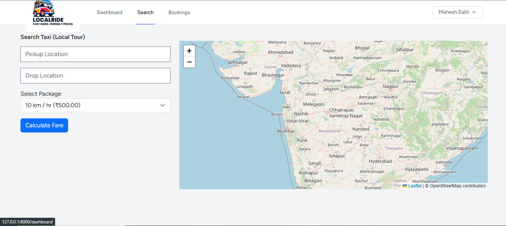
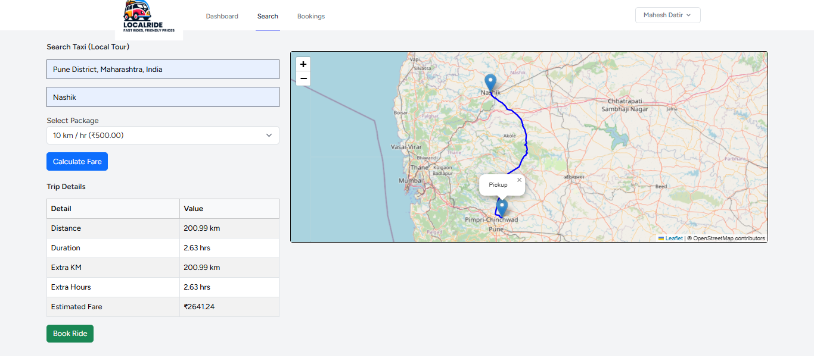
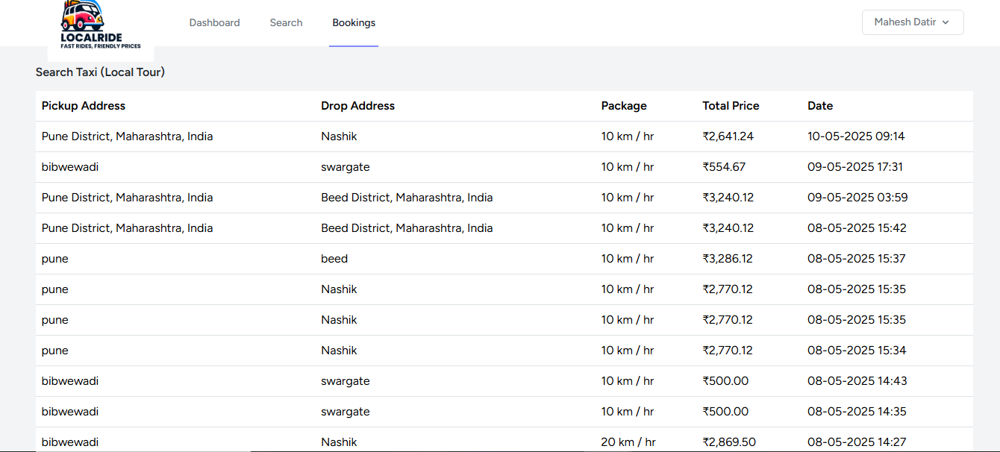

# 🚕 LocalRide - Local Taxi Booking System

LocalRide is a web-based taxi booking platform built using **Laravel 10**, **Leaflet.js**, and **OpenRouteService API**. It allows users to seamlessly search for local taxis, view routes, calculate fares dynamically, and confirm bookings—all through an intuitive interface.

## 🧩 Key Features

- ✅ User Registration & Authentication
- 📍 Search Taxis via Pickup and Drop Locations
- 🗺️ Interactive Route Mapping (Leaflet + OpenStreetMap)
- 📏 Distance & Duration Calculation (OpenRouteService)
- 💰 Dynamic Fare Estimation (Based on Distance & Package)
- 📋 Trip Summary & Booking Confirmation
- 🔐 Secure Form Validation

## 🔧 Tech Stack

- **Backend:** Laravel 10 (PHP)
- **Frontend:** Bootstrap 5, Blade Templates
- **Mapping:** Leaflet.js, OpenStreetMap
- **Distance & Routing:** OpenRouteService API
- **Geocoding (Future):** Nominatim API
- **Database:** MySQL

## 🔄 System Workflow

1. User enters pickup and drop location.
2. Coordinates are fetched using Nominatim or Google Places API.
3. OpenRouteService calculates route, distance, and duration.
4. Fare is dynamically computed based on selected package.
5. Trip route and fare summary displayed on map.
6. User confirms the booking; details saved in database.

## 📸 Screenshots

### 🔐 Login Page


### 📝 Register Page


### 🔍 Taxi Search & Home Page


### 🗺️ Route Display with Fare Summary


### ✅ Booking Confirmation


## 📌 Conclusion

LocalRide offers a robust starting point for a location-based taxi booking system. It’s scalable and ready for enhancements like real-time driver tracking, payment integration, and mobile responsiveness.

---

## 🚀 Get Started Locally

```bash
git clone https://github.com/mahi07777/localride.git
cd localride
composer install
cp .env.example .env
php artisan key:generate
php artisan migrate
php artisan serve
